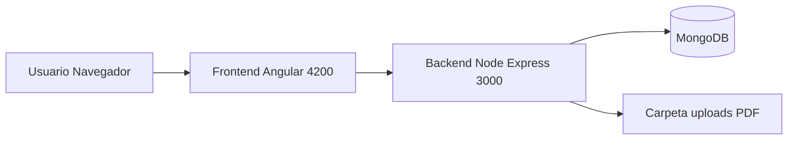
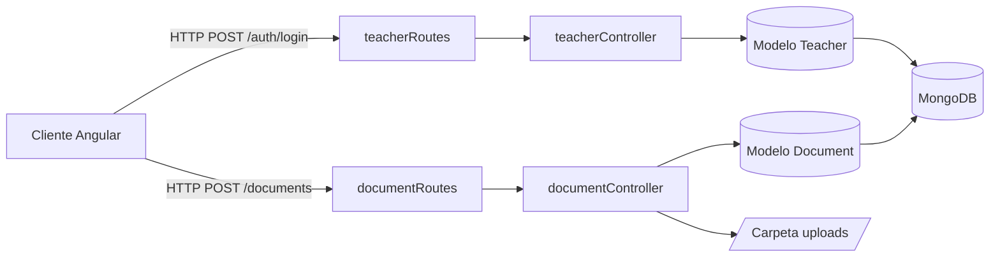
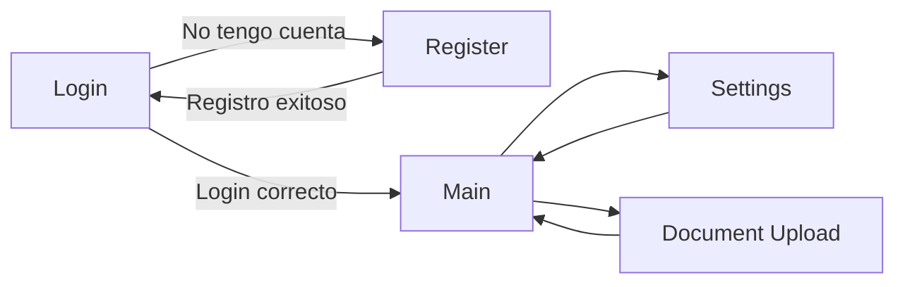

# 🎓 Portal de Consultas Académicas

Aplicación **Full Stack** para la gestión de docentes y consultas académicas. 
Incluye un frontend en **Angular** y un backend en **Node.js/Express** con base de datos **MongoDB**.

El sistema permite:
- 🔐 Registro e inicio de sesión de docentes.
- 🧑‍🏫 Gestión de perfil y configuración (página de *Settings*).
- 📄 Subida de documentos académicos (PDF u otros) asociados a docentes.
- 🧭 Listado y navegación entre páginas principales del portal.

### 🧮 Lenguajes principales (aprox.)

| Lenguaje              | Uso estimado | Barra de progreso        |
|-----------------------|-------------|--------------------------|
| 🟦 TypeScript /Angular | 60%         | ██████████░░░░░░         |
| 🟩 Node.js (Backend)  | 25%         | █████░░░░░░░░░░         |
| ⚪ HTML / CSS         | 15%         | ███░░░░░░░░░░░░         |

---

## 🗺️ Mapa visual rápido de la arquitectura



---

## 🧱 Estructura del proyecto

```bash
my-angular-app
├── backend/                      # API REST en Node.js/Express
│   ├── .env                      # Variables de entorno (no se sube a Git)
│   ├── package.json
│   └── src/
│       ├── db.js                 # Conexión a MongoDB
│       ├── server.js             # Punto de entrada del servidor Express
│       ├── controllers/
│       │   ├── teacherController.js   # Lógica de docentes
│       │   └── documentController.js  # Lógica de documentos
│       ├── models/
│       │   ├── Teacher.js        # Modelo de docente
│       │   └── Document.js       # Modelo de documento
│       ├── routes/
│       │   ├── teacherRoutes.js  # Rutas relacionadas con docentes
│       │   └── documentRoutes.js # Rutas relacionadas con documentos
│       └── uploads/              # Archivos subidos (PDF, etc.)
│
├── src/                          # Frontend Angular
│   ├── app/
│   │   ├── app.module.ts         # Módulo principal de la app
│   │   ├── app.component.*       # Componente raíz
│   │   ├── models/               # Modelos de datos del frontend
│   │   ├── services/             # Servicios (API docentes, documentos, etc.)
│   │   └── pages/                # Páginas principales
│   │       ├── login/            # Página de inicio de sesión
│   │       ├── register/         # Registro de docentes
│   │       ├── main/             # Página principal del portal
│   │       ├── settings/         # Configuración de usuario
│   │       └── document-upload/  # Subida de documentos
│   ├── assets/                   # Imágenes y recursos estáticos
│   ├── environments/             # Configuración de entornos
│   │   ├── environment.ts
│   │   └── environment.prod.ts
│   ├── styles.css                # Estilos globales
│   ├── main.ts                   # Punto de entrada Angular
│   └── index.html                # HTML principal
│
├── angular.json
├── package.json                  # Dependencias del proyecto Angular
├── tsconfig.json
└── README.md
```

---

## 🧩 Requisitos previos

- 🟢 Node.js (versión recomendada 18.x o superior)
- 📦 npm
- 🍃 MongoDB en ejecución (local o en la nube, por ejemplo Atlas)

---

## 🛠️ Configuración del backend

1. Entrar a la carpeta del backend:

	```bash
	cd backend
	```

2. Instalar dependencias del servidor:

	```bash
	npm install
	```

3. Crear el archivo `.env` en `backend/` con, por ejemplo:

	```env
	PORT=3000
	MONGODB_URI=mongodb://localhost:27017/consultas-academicas
	JWT_SECRET=un_secreto_seguro
	```

4. Iniciar el servidor de desarrollo:

	```bash
	npm run dev
	```

	Por defecto, la API quedará disponible en `http://localhost:3000/`.

---

### 🔁 Diagrama del flujo del backend



---

## 💻 Configuración del frontend (Angular)

1. Volver a la raíz del proyecto Angular (si no estás ya ahí):

	```bash
	cd my-angular-app
	```

2. Instalar dependencias del frontend:

	```bash
	npm install
	```

3. Iniciar la aplicación Angular en modo desarrollo:

	```bash
	npm start
	# o
	ng serve
	```

	La aplicación estará disponible en `http://localhost:4200/`.

> Asegúrate de que el backend esté corriendo para que las peticiones (login, registro, subida de documentos, etc.) funcionen correctamente.

---

## ⭐ Funcionalidades principales

- 🔑 **Autenticación de docentes**: páginas de *Login* y *Register* conectadas con la API.
- 👨‍🏫 **Gestión de docentes**: creación y consulta de docentes mediante `Teacher` en el backend.
- 📎 **Subida de documentos**: página `document-upload` que envía archivos al backend y los guarda en `uploads/`.
- ⚙️ **Configuración de usuario**: página `settings` para gestionar preferencias del docente.
- 🧩 **Arquitectura modular**: separación clara entre modelos, servicios, páginas y componentes.

---

### 🧭 Mapa de navegación de pantallas (frontend)



---

## 🧪 Scripts útiles

En la raíz de `my-angular-app`:

```bash
npm install        # Instala dependencias Angular
npm start          # Levanta el frontend en modo desarrollo
```

En la carpeta `backend`:

```bash
npm install        # Instala dependencias del servidor
npm run dev        # Levanta el backend con nodemon (si está configurado)
```

---

## 🤝 Contribuciones

Las contribuciones son bienvenidas. Para proponer cambios:

1. Haz un fork del repositorio.
2. Crea una rama para tu feature o corrección: `git checkout -b mi-feature`.
3. Envía un pull request describiendo claramente los cambios.

---

## 📄 Licencia

Este proyecto está bajo la Licencia MIT.